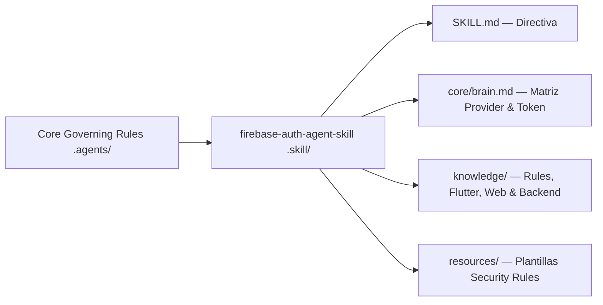

# 🔥 Firebase Auth Agent Skill

> **Skill Transversal** — Autenticación multi-proveedor (OAuth, Google, Apple, Email/Password, Anónimo), Custom Claims (RBAC), Firestore Security Rules e integración multilenguaje (Flutter, Web React/Svelte, Mobile Native, Node/Python).
> Skill de tipo **Transversal Agnóstica**.

---

## 📌 Propósito y Alcance

1. 🔑 **Autenticación Multi-Proveedor:** Patrones y flujos canónicos para Google OAuth, Apple Sign-In, Email/Password, Magic Link y sesión anónima.
2. 🛡️ **Seguridad & RBAC:** Gestión de Custom Claims, Firestore Security Rules (Reglas de acceso por usuario y rol), y refresco automático de tokens idToken.
3. 🌐 **Integración Multilenguaje:**
   - **Flutter / Dart:** `firebase_auth`, `flutter_secure_storage`, `GoRouter` Auth Guards.
   - **Web (React / Next.js / Svelte):** Client SDK, Server SDK (Admin App), Middleware Auth Guards.
   - **Backend (Node / Python):** Verificación de idTokens Bearer en endpoints HTTP.
4. 📋 **Generar** reportes de auditoría activa de configuración de autenticación y reglas de seguridad.

---

## ⚡ $-Comandos de Firebase Auth

| Comando | Acción | Descripción |
|---|---|---|
| `$firebaseauth` | Bootstrap | Carga la skill y verifica configuración de Firebase Auth. |
| `$firebaseauth:audit` | Auditoría | Inspecciona almacenamiento de tokens, Security Rules y OAuth Fingerprints. |
| `$firebaseauth:rules` | Generación | Genera plantilla estricta de Firestore/RTDB Security Rules. |
| `$learnskill firebase-auth-agent-skill [propuesta]` | Aprendizaje | Registrar mejora para `firebase-auth-agent-skill` en `overview/learning.md` |
| `$revlearnskill` | Revisión | Clasificar y consolidar propuestas de aprendizaje acumuladas. |

---

## 🧩 Arquitectura de la Skill



---

## 📦 Instalación como Submódulo

```bash
git submodule add https://github.com/Agent-Rules-Ecosystem/firebase-auth-agent-skill.git .skill/firebase-auth-agent-skill
```

Activar con: `$firebaseauth`
