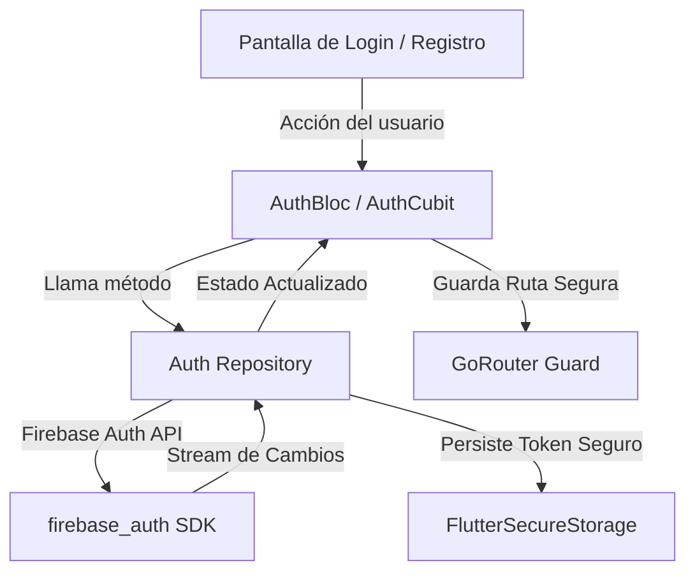

# 🔐 Flutter Firebase Auth Agent Skill

> **Habilidad Especializada en Autenticación Firebase, OAuth, Seguridad y Gestión de Sesiones para aplicaciones Flutter**.

Diseñado para implementar, asegurar y refactorizar flujos de autenticación completos en Flutter con Firebase Auth (Google Sign-In, Apple Sign-In, Email/Password, Anónimo), Firestore RBAC y Flutter Secure Storage.

---

## 📌 Propósito y Alcance

`flutter-firebase-auth-agent-skill` dota a los agentes de IA de arquitecturas de autenticación seguras y reactivas para Flutter:

1. **🔥 Firebase Auth Lifecycle**: Manejo de streams de estado de autenticación (`authStateChanges`), refresco automático de JWT ID Tokens e intercepción de caducidad.
2. **🌐 OAuth & Social Sign-In**: Integración nativa de Google Sign-In, Apple Sign-In y credenciales anónimas con vinculación de cuentas (*Account Linking*).
3. **🛡️ Control de Acceso basado en Roles (RBAC)**: Custom User Claims en Firebase Auth sincronizados con Security Rules de Firestore y Realtime Database.
4. **🔒 Almacenamiento Seguro de Sesión**: Cifrado local de tokens y metadata del usuario mediante `flutter_secure_storage` con protección biométrica.
5. **🚦 Guardias de Navegación & Middlewares**: Redirección automática de rutas protegidas y verificación de estado en `go_router` / `auto_route`.

---

## ⚡ $-Comandos de Auth

| Comando | Acción | Descripción |
|---|---|---|
| `$auth` | **Bootstrap Auth** | Activa la habilidad y escanea la pila actual de autenticación Firebase. |
| `$auth:init` | **Instalación** | Configura Firebase Auth, Repository y AuthBloc en el proyecto Flutter. |
| `$auth:social` | **OAuth Integrador** | Implementa credenciales de Google y Apple con gestión de scopes. |
| `$auth:rbac` | **Roles & Claims** | Configura Custom Claims y reglas de seguridad de Firestore (`request.auth`). |
| `$auth:audit` | **Auditoría de Sesión** | Audita fugas de tokens, manejo de errores de Auth y persistencia segura. |
| `$auth:test` | **Pruebas de Auth** | Genera mocks de `FirebaseAuth` y `UserCredential` para pruebas unitarias. |

---

## 🧩 Arquitectura de Autenticación Firebase en Flutter



---

## 📦 Instalación como Submódulo Git

> ⚠️ **Regla de Ubicación Obligatoria**: Las skills se instalan **únicamente** dentro del directorio `.skill/` en la raíz del proyecto huésped (a la misma altura que `.agents/`). **NUNCA** se deben colocar dentro de `.agents/`, la cual está reservada exclusivamente para el repositorio oficial de gobernanza (`*-agent-rules`).

```bash
# 1. Crear el directorio contenedor .skill/ en la raíz del proyecto (si no existe)
mkdir -p .skill

# 2. Agregar la skill como submódulo Git (usando el nombre completo del repositorio)
git submodule add https://github.com/xolotl-hub/flutter-firebase-auth-agent-skill.git .skill/flutter-firebase-auth-agent-skill
```

Para activar en la sesión actual:
```text
$auth
```
