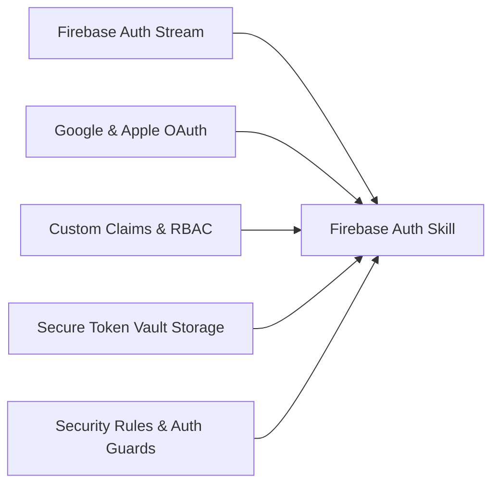

# ⚙️ Firebase Auth Agent Skill Directives

## 🎯 Capacidades de la Habilidad



---

## 📋 Protocolo de Auditoría de Autenticación (`$firebaseauth:audit`)

1. **Auditoría de Credenciales**:
   - Validar que las claves OAuth (`SHA-1` y `SHA-256` fingerprints) estén registradas en Firebase Console.
   - Validar configuración de `Services-Info.plist` y `GoogleService-Info.plist` en clientes móviles.
2. **Auditoría de Persistencia**:
   - Verificar que los tokens no se almacenen en texto plano sino en almacenes seguros (`FlutterSecureStorage` en Flutter, `httpOnly cookies` en Web).
3. **Auditoría de Security Rules**:
   - Auditar que las colecciones de Firestore restrinjan lecturas/escrituras validando `request.auth != null` y `request.auth.uid == userId`.

---

## 📝 Persistencia y Salida Activa (`overview/work/skill/`)

Al ejecutar esta skill (mediante `$firebaseauth` o `$firebaseauth:audit`), es **obligatorio crear o actualizar su reporte activo** dentro del proyecto cliente en la ruta:

`overview/work/skill/firebase-auth.md`

### Estructura Requerida del Reporte:

```markdown
# 📋 Registro Activo de Tareas — Firebase Auth Agent Skill

> **Generado por**: `firebase-auth-agent-skill` (`$firebaseauth:audit`)  
> **Última actualización**: YYYY-MM-DD  

## 🎯 Tareas Pendientes Accionables

| ID | Tipo | Estado | Resumen | Evidencia/Ruta | Acción Requerida |
|---|---|---|---|---|---|
| AUTH-01 | Fix / Refactor | Pendiente | <Resumen breve> | `<ruta:línea>` | <Remediación recomendada> |

## 📝 Observaciones y Detalles de Revisión
- Detalle técnico, evidencia o contexto extendido proporcionado por la revisión de la skill.
```
