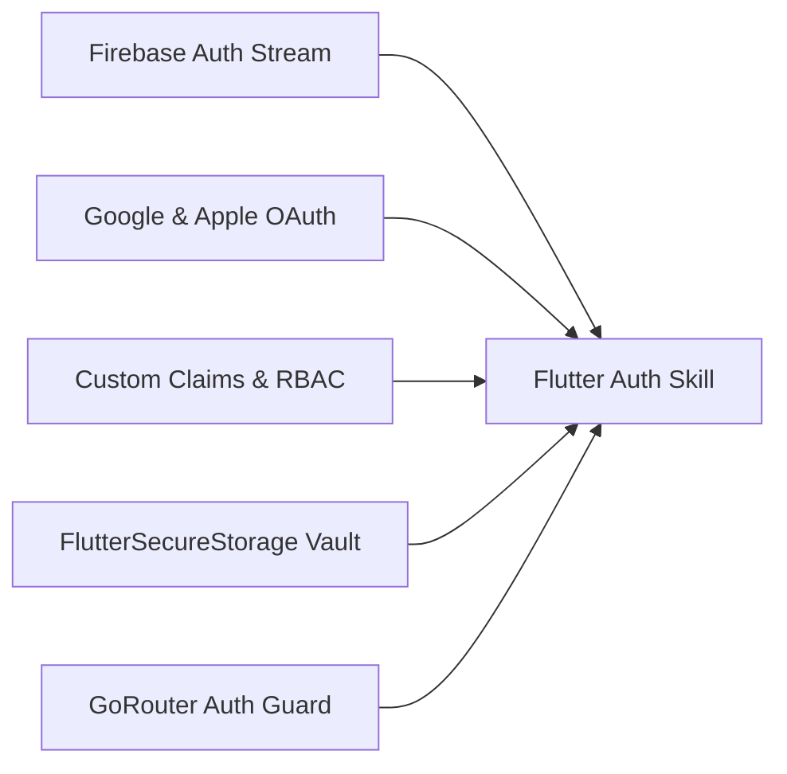

# ⚙️ Flutter Firebase Auth Skill Matrix & Directives

## 🎯 Capacidades de la Habilidad



---

## 📋 Protocolo de Auditoría de Autenticación (`$auth:audit`)

1. **Auditoría de Credenciales**:
   - Validar que las claves OAuth (`SHA-1` y `SHA-256` fingerprints) estén registradas en Firebase Console para Android.
   - Validar configuración de `Services-Info.plist` y `GoogleService-Info.plist` para iOS.
2. **Auditoría de Persistencia**:
   - Verificar si los tokens se almacenan en `SharedPreferences` (Inseguro) o `FlutterSecureStorage` (Seguro).
3. **Auditoría de Security Rules**:
   - Auditar que las colecciones de Firestore restrinjan lecturas/escrituras validando `request.auth != null` y `request.auth.uid == userId`.

---

## 🔒 Plantilla Canónica de Firestore Security Rules (RBAC)

```javascript
rules_version = '2';
service cloud.firestore {
  match /databases/{database}/documents {
    // Función auxiliar de autenticación
    function isAuthenticated() {
      return request.auth != null;
    }
    
    // Función auxiliar de propiedad de documento
    function isOwner(userId) {
      return isAuthenticated() && request.auth.uid == userId;
    }

    // Regla de perfil de usuario
    match /users/{userId} {
      allow read: if isAuthenticated();
      allow write: if isOwner(userId);
    }
  }
}
```
